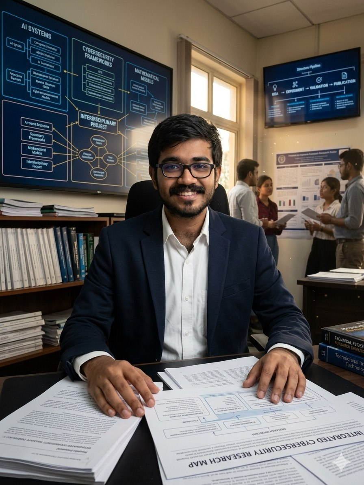
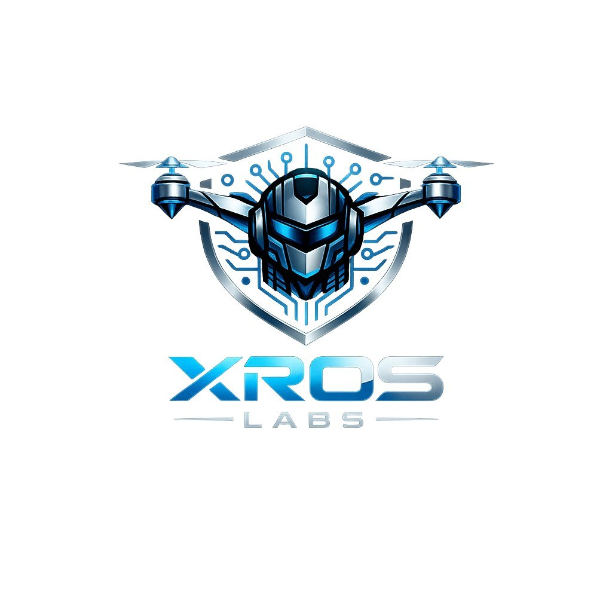

<table width="100%">
<tr>

<td align="left" valign="middle" width="24%">

</td>

<td align="center" valign="middle" width="52%">

<h1>Hi 👋 I'm Parthib Ghosh</h1>

<h3>
Researching Secure Cyber-Physical Systems, 
Digital Forensics & AI-driven Cyber Defense
</h3>

<b>Creator of RoboIDS • CipherAI • XROS Labs</b>

 

</td>

<td align="right" valign="middle" width="24%">

</td>

</tr>
</table>

---

# 👨‍💻 About Me

- 🔭 Currently building **Bhorosha** — an AI-powered Rural Cyber Safety Platform
- 🌱 Learning **ROS2, AI Agents, Formal Methods, Discrete Mathematics & Secure Robotics**
- 💬 Ask me about **Cybersecurity, ROS2, Digital Forensics, FastAPI, Python, React & Machine Learning**
- 🌐 Portfolio: **https://parthib2006.github.io/parthib2006/**
- 💼 LinkedIn: **https://www.linkedin.com/in/parthib-ghosh-758301259/**
- 📧 Email: **parthibghosh6@gmail.com**
- ⚡ I enjoy transforming research ideas into practical security prototypes.

---

# 🔬 Research Interests

- Cyber-Physical Systems Security
- Secure Robotics & ROS2
- Digital Forensics
- AI-driven Cyber Defense
- Intrusion Detection Systems
- Adversarial Machine Learning
- Multi-Agent Systems

---

## 🔬 Featured Projects

🛡️ **Bhorosha**
AI-powered Rural Cyber Safety Platform

🤖 **RoboIDS**
ROS2 Intrusion Detection Framework

🔍 **CipherAI**
AI-assisted Digital Forensics

🚁 **XROS Labs**
Open Research in Secure Robotics

---

# 🌐 Connect With Me

---

# 🛠 Languages & Tools

---

# 📊 GitHub Statistics

